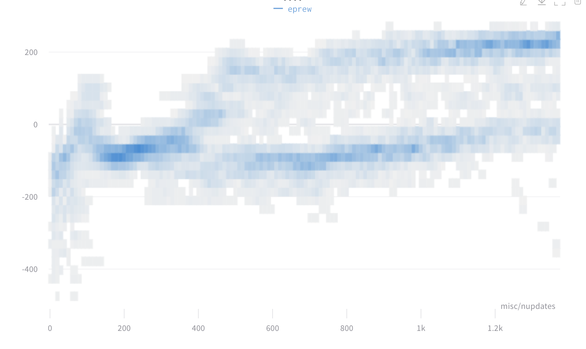
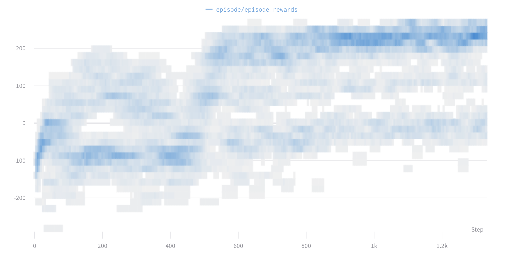
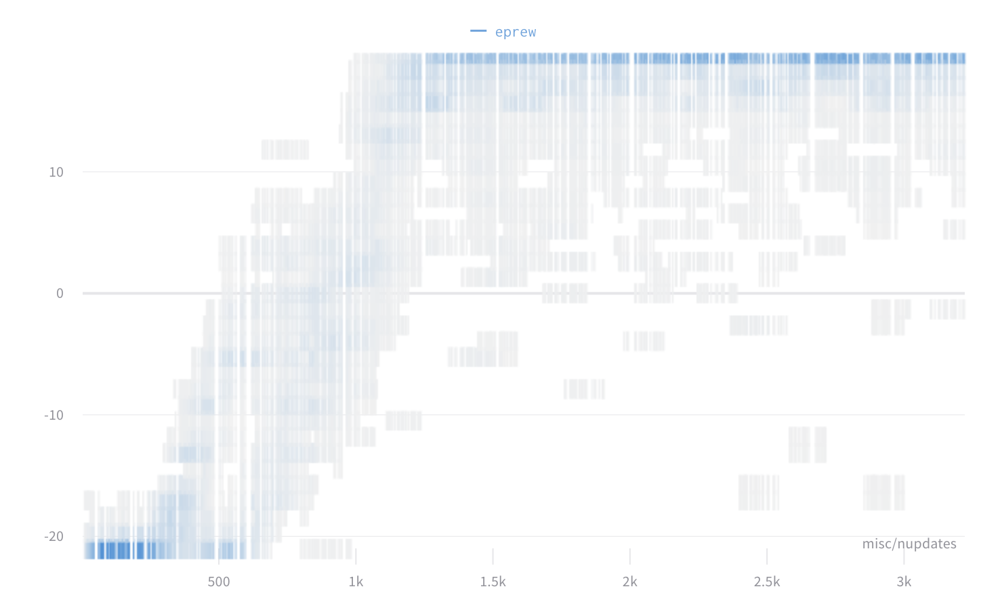
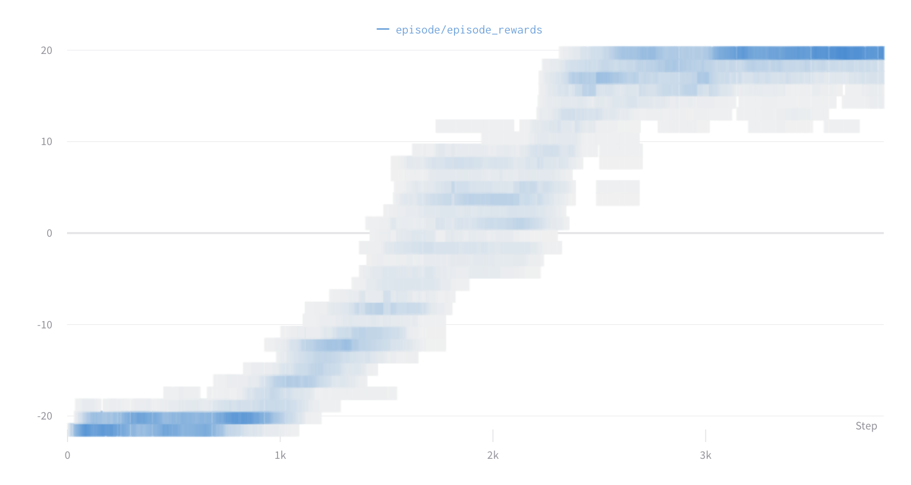

# Pytorch PPO
Simple, readable, yet full-featured implementation of PPO in Pytorch

## Motivation

The aim of this repository is to provide a minimal yet performant implementation of PPO in Pytorch. Mostly I wrote it just for practice, but also because all the major implementations of PPO are buried in large, complex, and minimally-commented repositories.

This implementation is only ~500 lines, yet includes all the various implementation tricks and details to get comparable performance (accuracy and speed) to the major implementations (eg OpenAI's baselines repo). All the key algorithmic code is in this repo - there aren't dependencies to other repos for normalization, advantage estimation, etc.

It supports:
- Continuous and discrete action spaces
- Low-dimensional state spaces with a MLP and high-dimensional image-based state spaces with a CNN

This means it should be able to run the majority of environments in the OpenAI Gym - I've tested it with the Box2d environments and the Atari environments.

It is a parallel implementation, capable of spawning multiple processes to run the environment simulations and with each process recording observations into shared memory for maximum performance.

## Installation and Usage

The key dependences are the OpenAI Gym and Pytorch. It runs on CPU or CPU+GPU. For MuJoCo environments, you'll need that (proprietary) dependency also.

You can run the code with by running `main.py` with any desired arguments, eg
`main.py --env_name="LunarLander-v2" --model="mlp"`.

You must make sure that the model type (`mlp` or `cnn`) matches the environment you're training on.

It will default to running on CPU. To use GPU, use the flag `--device="cuda"`.

I'd highly recommend using Weights and Biases for detailed logging. `pip install wandb`, and then use the flag `logger="wandb"`.

All available arguments can be viewed by running `main.py --help`.

I suggest trying out the Box2d environments such as `LunarLander-v2` and `BipedalWalker-v2` as they're free (unlike MuJoCo) and are what I've tested with. The Atari environments are also included with Gym, but take longer to train. `PongNoFrameskip-v4` is a simple one to test.

## Performace comparison to OpenAI Baselines

To be sure that the performance is comparable to existing implementations, I instrumented the baselines repo with more detailed logging code. I ran both with as similar hyperparameters as I could.

The charts are histograms of complete episode returns per step of the algorithm (one step is a batch of 8 partial episodes, each partial episode with 128 timesteps).

Check out the full, detailed metrics at the "all logging data" links below the charts.

### `LunarLander-v2`

#### OpenAI Baselines
`python -m baselines.run --alg=ppo2 --network=mlp --num_timesteps=2e8 --ent_coef=0.01 --num_hidden=64 --num_layers=3 --value_network=copy --num_env=12 --lr=2.5e-4 --vf_coef=.5 --max_grad_norm=.5 --gamma=.99 --lam=.95 --nminibatches=4 --noptepochs=4 --cliprange=.1 --nsteps=128 --env="LunarLander-v2"`

[all logging data](https://app.wandb.ai/zplizzi/test/runs/11hm85w6?workspace=user-zplizzi)

#### This code
`python main.py --env="LunarLander-v2" --model="mlp"`

[all logging data](https://app.wandb.ai/zplizzi/test/runs/ne3xw444?workspace=user-zplizzi)

### `PongNoFrameskip-v4`

I didn't spend as much effort making sure my CNN model and hyperparameters are exactly the same as Baselines, so these charts don't match as well as the with LunarLander. However, the overall final performance and time to convergence are similar.

#### OpenAI Baselines
`export CUDA_VISIBLE_DEVICES=1 && python -m baselines.run --alg=ppo2 --network=cnn --num_timesteps=2e8 --ent_coef=0.01 --num_env=12 --lr=2.5e-4 --vf_coef=.5 --max_grad_norm=.5 --gamma=.99 --lam=.95 --nminibatches=4 --noptepochs=4 --cliprange=.1 --nsteps=128 --env="PongNoFrameskip-v4"`

[all logging data](https://app.wandb.ai/zplizzi/test/runs/6f9f2llh?workspace=user-zplizzi)

#### This code
`python main.py --env="PongNoFrameskip-v4" --model="cnn" --end_on_life_loss=True --clip_rewards=True`

[all logging data](https://app.wandb.ai/zplizzi/test/runs/trr799x9?workspace=user-zplizzi)

### Speed comparison

When training on `PongNoFrameskip-v4`, this code processes 1400 frames per second (on a GCP V100 server). The OpenAI baselines repository, running PPO on the same environment, a similar model, and the same hardware, reported 1600 frames per second.

## Implementation Details

Beyond the standard PPO algorithm, there are some implementation details drawn from the baselines repo that turned out to be important in matching the performance:
- Using Generalized Advantage Estimation for advantages and cumulative discounted future rewards
- Using multiple parallel environment rollouts
- Using value clipping with a PPO-style confidence interval region
- Normalizing the advantages, observations, and rewards (each with different methods) for MLP
    - Advantages are normalized per-iteration by mean centering and dividing by the standard deviation
    - Observations are normalized by mean centering and dividing by the standard deviation using cumulative statistics computed from the start of training
    - Per-step rewards are normalized by dividing by the standard deviation of the discounted cumulative rewards using cumulative statistics computed from the start of training
- Using an orthogonal initialization of the layer weights
- Using tanh nonlinearities in the MLP
- For Atari, there are a variety of other tricks:
    - Clipping the per-step rewards to {-1, 0, 1}
    - Skipping 3 environment steps for every step used for training
    - Converting the images to 1-channel grayscale, warping to 84x84, and rescaling to [0, 1], but no further normalization
    - Don't normalize rewards at all, beyond the clipping
    - Applying what seems to be standard practice (but seems like cheating) where you end the episode when a life is lost in the game (but don't reset the environment).
